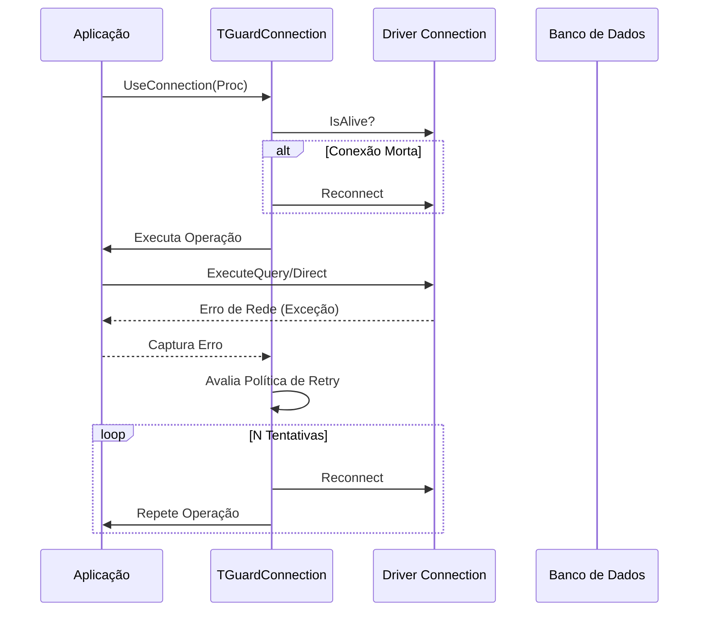

# Resiliência de Conexão e Health Checks

O sistema de resiliência do **DataEngine** permite que o framework detecte falhas de rede de forma transparente e execute tentativas de recuperação (retries) baseadas em políticas configuráveis. Isso transforma o `TGuardConnection` em um componente de alta disponibilidade.

## Visão Geral

Em ambientes instáveis (conexões VPN, Cloud SQL ou Mobile), quedas transitórias de rede podem interromper operações. O DataEngine resolve isso através de:

1.  **Health Check (`IsAlive`):** Verificação ativa da saúde da conexão física.
2.  **Retry Orchestration:** Repetição automática de comandos que falharam devido a perda de conexão.
3.  **Resilience Policies:** Estratégias customizáveis para gerenciar o tempo e a quantidade de tentativas.

## Como Funciona

Quando uma operação é executada através do `TGuardConnection`, o fluxo de resiliência entra em ação:



## Configuração

A configuração de resiliência é feita diretamente no Guard ou no Pool:

```delphi
var
  LGuard: IGuardConnection;
begin
  LGuard := TDataEngine.Guard(LConnection);
  
  // Configura a política de resiliência
  LGuard.Resilience
    .RetryCount(3)
    .RetryDelay(500) // ms
    .Enabled(True);

  LGuard.UseConnection(
    procedure(const AConn: IDBConnection)
    begin
      // Esta operação será repetida automaticamente se a rede cair
      AConn.ExecuteDirect('UPDATE Pedidos SET Status = 1 WHERE ID = 10');
    end);
end;
```

### Propriedades da Política

| Propriedade | Padrão | Descrição |
| :--- | :--- | :--- |
| `RetryCount` | 3 | Número máximo de tentativas após a falha inicial. |
| `RetryDelay` | 500ms | Tempo de espera entre cada tentativa. |
| `Enabled` | True | Ativa ou desativa o mecanismo de retry. |

## Health Checks no Pool

O `TPoolConnection` utiliza o método `IsAlive` para garantir que conexões "zumbis" (que ficaram inativas por muito tempo e foram derrubadas pelo servidor) não sejam entregues à aplicação.

- Se `IsAlive` retornar `False`, o pool descarta a instância e cria uma nova conexão transparente.
- O `IsAlive` executa um "SQL Ping" leve no banco de dados.

## Boas Práticas e Restrições

- **Idempotência:** O retry automático é seguro para `SELECT`. Para operações DML (`INSERT`, `UPDATE`), certifique-se de que a repetição não causará efeitos colaterais (o DataEngine tenta detectar se o erro ocorreu antes ou depois do comando atingir o banco).
- **Transações:** Operações dentro de uma transação aberta **não** sofrem retry automático se a conexão cair, pois o estado da transação no servidor foi perdido. Nesse caso, a exceção é propagada normalmente para que a aplicação trate o Rollback.
- **Overhead:** O `IsAlive` não é disparado em cada query, apenas quando uma conexão é retirada do pool após um período de inatividade ou após uma falha detectada.

## Customização

Você pode implementar sua própria política de resiliência (ex: Exponential Backoff) implementando a interface `IDBResiliencePolicy`:

```delphi
type
  TCustomResiliencePolicy = class(TInterfacedObject, IDBResiliencePolicy)
  public
    function ShouldRetry(const AException: Exception; const ARetryCount: Integer): Boolean;
    function GetNextDelay(const ARetryCount: Integer): Integer;
  end;
```
